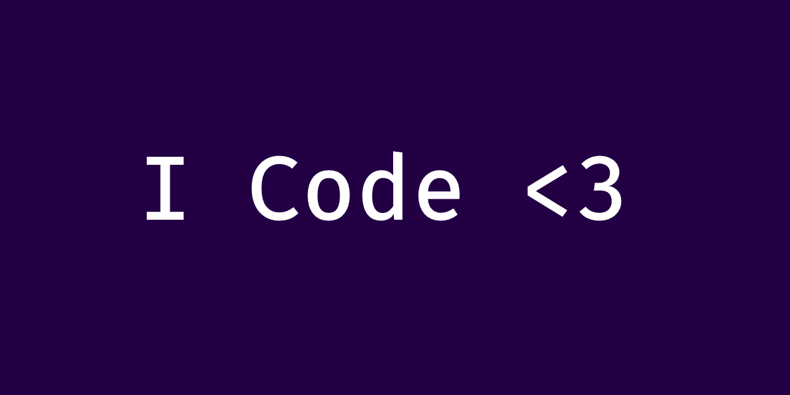

<body align="middle">
    
<h3>
    <b>
        <i>
        "The essence of life is the experience of this what we ought to be life, itself. The answer is you." -Dashie
        </i>
    </b>
</h3>
    <h1>
        <b> 
            Hey there, I am Dashie 👋
        </b>
    </h1>
    <h4>
        I love to code anything that comes up within me. The possibilities are endless in the world of programming. The only limitation a programmer will come across is their inability to express their creativity in terms of programmatic terminology. Intriguiging it is. 
          
        Though programming is one of my strongest aspects, it is not the only one. To encapsulate my daily interests into a few words; I am forever learning, I study every single day just because I like to. The ability to project your subjective idea onto the objective reality is one of my main focuses. Programming in that sense allows you to do so. Hence my obsession. 
          
        I have been programming on a systematic level since 2013. I have obtained quite a lot of experience over the years. I just never felt like sharing this experience, until now. I can now see the use of it. The present only exists because of the past. Therefore I embrace both. It is the reason for my success.
    </h4>
<h2>
    <b>
        Languages of Familiarity 🍄
    </b>
</h2>

<h2>
    <b>
        IDEs of Familiarity 💻
    </b>
</h2>

<h2>
    <b> 
        My Stats 📊 
    </b>
</h2>

<h2>
    <b> 
        Ways of Reach 📝 
    </b>
</h2>
    <h4>
        
        
        
        
        
    </h4>
</body>